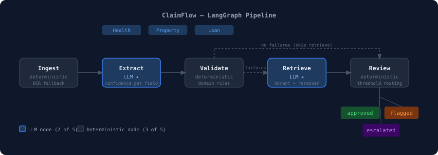

# ClaimFlow

ClaimFlow is a configurable document-review and exception-routing system with a CMS-1500 reference implementation.

**The problem:** claim and application packages arrive as messy, multi-document PDF bundles (born-digital or scanned) that need structured data pulled out, checked against domain rules, and routed to a human reviewer when something doesn't add up — without a black box either fabricating values or silently rubber-stamping bad ones.

**The stable workflow**, the same seven stages regardless of domain:

`upload → classify → OCR/extract → structured extraction with evidence → deterministic validation → conditional policy retrieval → routing recommendation → human review/audit`

Human review is triggered by validation failures, low-confidence or conflicting extractions, and configured high-risk conditions. Routing labels (`ready_for_processing` / `needs_review` / `blocked_or_incomplete`) are a recommendation for a human reviewer — ClaimFlow does not claim to make a final approval, coverage, lending, or medical decision.

Unlike a plain "PDF to JSON" extractor, ClaimFlow is built for workflows where extracted values have to be auditable and safe to act on downstream — not just plausible-looking.

Ships with three claim domains out of the box: **CMS-1500 health**, **Xactimate property damage**, and **SBA loan applications**.

**Supported inputs:** born-digital PDFs, scanned/image-only PDFs processed through [doc-intel](../doc-intel)'s configured OCR backend (PaddleOCR-VL by default, with LightOn and Tesseract as configurable fallback providers), standalone images (PNG/JPG/WEBP/TIFF/BMP), DOCX (converted to PDF via LibreOffice so it goes through the same page-based pipeline as everything else), and multi-document packages mixing any of these.



## Best fit

ClaimFlow is best suited for:

- OCR + structured extraction from claim/application packages
- deterministic validation of extracted values
- human-in-the-loop review workflows
- claim/application triage: `ready_for_processing` / `needs_review` / `blocked_or_incomplete`
- cited policy support for policy-relevant validation failures

It is not a production HIPAA/compliance system as-is.

## DomainPack: how a domain is configured

Everything domain-specific — health, property, loan, and each document type within them — is defined by one `Domain` dataclass (the DomainPack, `src/claimflow/domains/base.py`) registered per document type. Its fields:

- `doc_type`, `keywords` — classification identity
- `spec` — the extraction schema (a doc-intel `SchemaSpec`)
- `validate` — the deterministic validator function
- `supporting_types` — related classification-only document types
- `display_name`, `policy_collection`, `reviewer_guidance` — presentation/context
- `retrieval_mode` — `"official_deterministic"` (CMS-1500 only) or `"llm_synthesis"` (every other domain)
- `question_templates` — per-rule policy question templates, also what makes a failure `policy_required`
- `confidence_threshold` / `escalation_threshold` — optional per-domain overrides of the global settings

Eight packs are registered today: `cms1500`, `eob`, `medicare_summary_notice` (health, `src/claimflow/domains/health.py`); `xactimate`, `declarations_page` (property, `src/claimflow/domains/property.py`); `loan`, `sba_form_413`, `sba_form_2202` (loan, `src/claimflow/domains/loan.py`).

**What's inspectable today, read-only:** `GET /domain-packs` lists every registered pack (key, display name, document types); `GET /domain-packs/{key}` returns its full detail — required/optional fields (derived from the Pydantic schema), confidence/escalation thresholds, policy collection, retrieval mode, and reviewer guidance.

**What still requires editing code:** there is no schema editor, no rule-language interpreter, and no admin UI for defining a new domain — adding a validator, a new extraction field, or a new document type means editing the Python module that registers the pack. Domain-pack configuration is developer-controlled today, not admin-configurable; the inspector endpoints exist to make what's registered visible, not to let it be edited from outside code.

## Pipeline

| Node | Type | What it does |
|------|------|--------------|
| Ingest | Deterministic | Reads PDFs, images, and DOCX from the package directory; text-layer detection and OCR fallback via [doc-intel](../doc-intel)'s `build_artifact()`; classifies every document by type |
| Extract | LLM | Structured field extraction via [doc-intel](../doc-intel); confidence + source evidence per field |
| Validate | Deterministic | Domain-specific rule checks (arithmetic, lookup tables, date windows) |
| Retrieve | Hybrid / source-grounded | Domain-filtered Qdrant search; deterministic official-source answers for CMS-1500; cross-encoder rerank + LLM synthesis for other domains |
| Review | Deterministic | Confidence + failure thresholds → routing decision; human review is triggered by validation failures, low-confidence or conflicting extractions, and configured high-risk conditions |

Retrieve calls Qdrant only when at least one validation failure is `policy_required=True` (see [Validation rules](#validation-rules)) — it returns no policy answers, with no Qdrant call at all, when Validate finds no failures, or when every failure it found is a plain missing-field/arithmetic mismatch with no policy angle.

## Document classification

Every document in a package is classified, not just the primary claim form — a package is treated as messy by default. Classification is deterministic keyword matching (same mechanism used to detect a package's domain), so it's fast and has no LLM cost.

**Deep extraction** means a document type has its own schema, field-level confidence/evidence, and deterministic validator. **Classification-only** means the document is recognized and routed for manual triage — no structured extraction is attempted.

| Domain | Deep extraction | Classification-only |
|--------|-----------------|----------------------|
| Health | `cms1500`, `eob`, `medicare_summary_notice` | `medical_bill`, `insurance_policy`, `denial_letter`, `clinical_note`, `lab_report`, `discharge_summary`, `referral_letter`, `prior_authorization_letter`, `eligibility_benefits_verification`, `ub04_cms1450`¹ |
| Property | `xactimate`, `declarations_page` | `loss_report`, `contractor_invoice`, `adjuster_notes`, `roof_inspection_report`, `damage_photo`², `material_receipt`, `fire_report`, `police_report` |
| Loan | `loan`, `sba_form_413`, `sba_form_2202` | `tax_return`, `bank_statement`, `balance_sheet`, `income_statement`, `id_document`, `supporting_exhibit`, `profit_loss_statement`, `debt_schedule`, `business_license`, `articles_of_incorporation`, `payroll_report`, `w2_1099_paystub` |

¹ UB-04/CMS-1450 is classified but not deep-extracted — production-grade support needs licensed NUBC/AHA data specs, not shipped here.
² Damage photos are classified but not reasoned about — real damage assessment needs a vision-language model, not implemented yet (tracked as a TODO, not claimed as working).

Anything that matches no known pattern is labeled `unknown` rather than silently dropped, so it's still visible for manual triage.

Classification is deterministic keyword matching, so every result carries a **reason** (which keyword matched, and for which type) — surfaced via `GET /packages/{package_id}/documents`. A reviewer can override a misclassified document with `POST /packages/{package_id}/documents/{document_id}/reclassify`, then `POST /packages/{package_id}/process` to reprocess it — the new type's schema and validators run on the next pass, and the package's detected domain is re-derived from the overridden classification.

## Source evidence

Every extracted field carries where it came from, not just its value:

```json
{
  "name": "patient_name",
  "value": "John Smith",
  "confidence": 0.91,
  "grounded": true,
  "evidence": {
    "page": 1,
    "text": "Patient's Name: John Smith",
    "bbox": [120.0, 244.0, 310.0, 260.0],
    "block_type": "paragraph"
  },
  "field_status": "found"
}
```

`bbox` is populated for born-digital pages (from PDF layout) and for most OCR'd pages (from OCR element coordinates); it's `null` when a page has no recoverable coordinates. The Streamlit review UI renders the source page with the evidence region highlighted, so a reviewer can check a value against the original document without opening the PDF separately.

## OCR proof

Scanned pages don't get a black-box "trust the model" treatment:

- **Side-by-side page viewer** — the review UI renders the original page image next to its extracted text (native text layer, or on-demand OCR for scanned pages), with page navigation and a "jump to this field's evidence" shortcut.
- **Low-quality scan detection** — a density heuristic (extracted characters vs. a normal text page) flags likely-failed scans. The currently used OCR path may not expose reliable per-word confidence, so ClaimFlow also records this separate scan-quality heuristic — it's a detection signal, not a per-word confidence metric.
- **OCR fallback log** — every page that triggers OCR (no text layer) is logged, with a distinct low-quality-scan warning when OCR yields very little text.

## Product UI (Next.js)

The operator-facing product interface — App Router, TypeScript, Tailwind, shadcn/ui — lives in [`frontend/`](frontend/). It talks to the FastAPI backend exclusively through its documented, OpenAPI-typed contract (types generated via `openapi-typescript` from a live `/openapi.json` dump — see `frontend/src/lib/api-types.ts`); it never calls doc-intel, the database, or Qdrant directly.

**Routes:** `/dashboard`, `/packages`, `/packages/new`, `/reviews`, `/packages/[packageId]` (the package workspace), `/settings`.

**Package workspace** (`/packages/[packageId]`) is the primary screen: a resizable three-pane layout — document list, original-page viewer with server-rendered bbox evidence highlighting, and a tabbed review panel (Overview / Fields / Validation / Policy evidence / Audit). Selecting a field opens its source document at the right page with the evidence region highlighted; scalar and nested (`service_lines`/`line_items`) fields both support approve/edit/reject; re-running validation calls the same endpoint the Streamlit prototype uses — no validation logic is duplicated in the frontend. On tablet/mobile the document list moves into a Sheet and the viewer/tabs stack vertically instead of resizing side by side.

**Run it:**
```bash
cd frontend
npm install
cp .env.local.example .env.local   # NEXT_PUBLIC_API_BASE_URL, defaults to localhost:8010
npm run dev                        # http://localhost:3000 (or next free port)
```
Requires the FastAPI backend running (`make api`) and reachable at that URL.

**Streamlit** (`streamlit_app.py`) remains a functional review prototype used to validate workflow behavior during backend development, not the product interface — the Next.js app above is. Streamlit still exercises the same endpoints and is useful for quick backend smoke-testing, but new review-workflow features land in `frontend/` going forward.

Streamlit's own review queue still offers, for reference:
- Per-field **approve / edit / reject**, with an editable corrected value
- **Nested fields are editable.** List-of-object fields such as `service_lines` and `line_items` support row-level add, edit and delete actions, with stable row identity and row-specific confidence/evidence. Flat scalar lists such as `diagnosis_codes` are also editable as a list, but currently retain field-level confidence and evidence rather than independent confidence/evidence per code.
- **Suggested correction** — surfaces the deterministic validator's own failure reason next to the field it flagged (e.g. "line sum $412.00 does not match total charge $450.00")
- **Re-run validation** — after edits, re-runs the domain's real deterministic validator against the reviewer's corrected values, not a reimplementation
- **Export** — reviewed fields, scalar and nested/list alike (original value, action taken, final value, confidence) download as JSON, ready for downstream handoff

## Validation rules

Deterministic, not LLM self-verification — the same numbers, codes, and dates get the same result every run. A checksum, a lookup-table membership check, or an arithmetic reconciliation (line-item sum vs. printed total) has one correct answer; asking an LLM to re-check its own extraction risks it rationalizing a wrong value instead of catching it, and would make the same input non-reproducible across runs. Every validation failure carries a `severity` (`error` or `warning`) and a `policy_required` flag.

**`policy_required` gates policy retrieval.** It's `True` only when a domain's `question_templates` has a matching entry for that rule (or for the CMS-1500 NPI-format special case) — i.e. when there's an actual policy citation to retrieve. A plain missing-required-field or an arithmetic-only mismatch (e.g. "line sum doesn't match total") is `policy_required=False` and never triggers a Qdrant lookup; `retrieve_node` filters to `policy_required=True` failures before calling Qdrant at all.

| Domain | Example checks |
|--------|----------------|
| Health (CMS-1500) | missing mandatory field, malformed NPI (not exactly 10 digits), invalid ICD-10 code, invalid CPT code, service-line total ≠ claimed total, future date of service |
| Health (EOB / MSN) | provider charges ≥ allowed charges, non-negative amounts, `is_bill` must be False (an EOB/MSN is informational by design), placeholder-pattern claim number, future service date |
| Property (Xactimate) | missing mandatory field, line-item sum ≠ printed line-item subtotal, subtotal + overhead + profit + tax ≠ RCV, ACV/RCV inconsistency, date of loss outside policy window, negative dollar amounts |
| Property (declarations page) | policy period start ≤ end, non-negative coverage limits/deductibles/premium, placeholder-pattern policy number |
| Loan (SBA application) | missing mandatory field, placeholder-pattern tax ID, business name where a person's name is expected, non-positive loan amount, net income exceeds gross revenue, missing signature |
| Loan (SBA Form 413) | total assets − total liabilities = net worth (within tolerance), non-negative amounts, future as-of date, business name where a person's name is expected |
| Loan (SBA Form 2202) | sum of current balances = reported total, current balance ≤ original amount (unless revolving/deferred), maturity date ≥ origination date |

## CMS-1500 demo flow: one package end to end

The CMS-1500 pack is ClaimFlow's reference implementation — the domain with the deepest validation and the only one with deterministic, officially-sourced policy answers. A real run against `data/synthetic/health/package_004` (one input file, `claim.pdf` — a born-digital CMS-1500 form with a genuinely invalid injected diagnosis code) through the seven-stage workflow:

**1. Classified documents**

| File | Classified as | Text layer |
|------|---------------|------------|
| `claim.pdf` | `cms1500` | born-digital |

**2. Extracted fields** (excerpt, with source evidence)

```json
{
  "name": "patient_name",
  "value": "TAYLOR MICHAEL",
  "confidence": 1.0,
  "grounded": true,
  "field_status": "found",
  "evidence": { "page": 1, "block_type": "paragraph", "bbox": [19.84, 83.09, 89.63, 94.08] }
}
```

**3. Validation failures**

```json
[{ "field": "diagnosis_codes", "rule": "icd10_lookup", "reason": "'XXXXX' is not a recognized ICD-10-CM code" }]
```

**4. Final decision**

```
decision: needs_review
review_reasons:
  - "diagnosis_codes: 'XXXXX' is not a recognized ICD-10-CM code"
```

**5. Reviewer export** (after approving the scalar fields in the Streamlit review queue)

```json
{
  "decision": "needs_review",
  "domain": "cms1500",
  "fields": {
    "patient_name": { "original_value": "TAYLOR MICHAEL", "action": "approve", "final_value": "TAYLOR MICHAEL", "confidence": 1.0 },
    "total_charge": { "original_value": 121.0, "action": "approve", "final_value": 121.0, "confidence": 1.0 }
  }
}
```

`diagnosis_codes` (the field the validator actually flagged) is a list, not a scalar. It's editable as a list, and the reviewed export records the original and final values plus the reviewer action per entry — but confidence and evidence currently remain attached to the field as a whole, not independently per code (see [Known limitations](#known-limitations)).

## Setup

```bash
# 1. Clone and install
git clone <repo>
cd claimflow
uv sync

# 2. Configure
cp .env.example .env
# edit .env — set ANTHROPIC_API_KEY at minimum

# 3. Start Qdrant
make docker-up

# 4. Generate the demonstration policies and seed all policy PDFs
uv run python scripts/generate_policies.py
make seed

# 5. (Optional) Generate synthetic claim packages for eval
make generate

# 6. Start the API
make api
# or the Streamlit UI:
make ui
```

## Commands

| Command | Description |
|---------|-------------|
| `make api` | Start FastAPI on port 8010 |
| `make ui` | Start Streamlit review UI on port 8011 |
| `make test` | Run test suite |
| `make lint` | ruff check + format check |
| `make eval` | Run 3-domain eval against `data/synthetic/` |
| `make docker-up` | Start Qdrant |
| `make docker-down` | Stop Qdrant |
| `make seed` | Index policy PDFs into Qdrant |
| `make generate` | Generate synthetic claim packages |

The CMS policy corpus also includes the official Medicare Claims Processing
Manual Chapter 26 and CMS NPI fact sheet. Their source URLs and the distinction
between authoritative CMS material and synthetic demonstration policies are
recorded in [`data/policies/SOURCES.md`](data/policies/SOURCES.md). CMS-1500
retrieval excludes the synthetic manuals.

## Persistence and workflow state

ClaimFlow persists the package lifecycle rather than returning only a one-off pipeline response. The data model (SQLite via SQLAlchemy, `src/claimflow/db.py`, migrated with Alembic — `alembic/versions/`) separates:

- packages
- source documents
- extraction runs (one per document, per attempt — reprocessing creates a new run, it doesn't overwrite the last one)
- extracted fields (including per-row entries for list-of-object fields, via `parent_field`)
- validation failures (superseded, not deleted, on revalidation — old failures stay queryable for audit)
- policy evidence
- review actions (per-field approve/edit/reject, keeping the machine value, reviewer correction, and note distinct)
- package decisions (`ready_for_processing`/`needs_review`/`blocked_or_incomplete`, one row per decision — a package can have more than one over its life)
- audit events (`audit_log` table — see [package deletion](#package-deletion-and-audit-retention) below)

Machine-extracted values are retained separately from reviewer corrections and final approved values. Re-running validation (`POST /packages/{id}/validation/re-run`) uses the corrected values without deleting the original extraction or the prior validation-failure history — it marks the old failures `superseded=True` and inserts the new set.

### Package lifecycle

Status values (`PackageStatus` enum, `src/claimflow/schemas/enums.py`):

```text
uploaded → queued → processing → review_ready → completed
                              ↘ processing_error / validation_error / retrieval_error
```

`status` (processing lifecycle) and `decision` (`ready_for_processing` / `needs_review` / `blocked_or_incomplete`, the routing outcome) are stored and returned separately — a package's `status` becomes `review_ready` or `completed` regardless of which decision the routing step produced; `needs_review`/`blocked_or_incomplete` are recommendations for a human reviewer, not final adjudications — ClaimFlow does not make a final approval/coverage/lending/medical decision. Per-field reviewer actions (`approve`/`edit`/`reject`/`add`) are a third, distinct vocabulary — `ReviewActionType`.

`POST /packages/{id}/validation/re-run` re-runs the domain's real deterministic validator against the reviewer's corrected values and recomputes the routing decision, returning `decision`, `decision_changed`, and `previous_decision` — a correction can move a package from `needs_review` back to `ready_for_processing`, or the reverse.

A package can be reprocessed (`POST /packages/{id}/process`) after document reclassification or a processing error; this is an atomic compare-and-swap on `status` (`try_start_processing`) so two concurrent `/process` calls can't both run the graph — the second gets a 409. A crash mid-`processing` is recovered at the next app startup (`recover_stale_processing_packages`) rather than left stuck.

### Package deletion and audit retention

`DELETE /packages/{id}` cascades to the package's documents, extraction runs, fields, validation failures, policy evidence, and decisions (real FK `ON DELETE CASCADE`). Audit events are the one exception: `AuditLogEntry.package_id` is deliberately **not** a foreign key — it's a plain indexed string column — so the audit trail survives the package row being deleted.

## API

22 endpoints. OpenAPI schema is auto-generated by FastAPI and served at `/docs` (Swagger UI) and `/openapi.json`; `tests/test_openapi_contract.py` checks the schema matches the actual response models exactly (it asserts the full route set, so this count can't silently drift from the code).

**Error shape** (all 4xx/5xx responses, `src/claimflow/schemas/errors.py`):
```json
{"error": {"code": "PACKAGE_NOT_FOUND", "message": "Package does not exist", "details": null}}
```

**Idempotency:** `POST /packages/{id}/fields/{field_id}/review` is idempotent — an identical repeated review action (same action, corrected value, reviewer, note) returns the existing row instead of inserting a duplicate. `POST /packages/{id}/process` rejects a concurrent duplicate call with `409 PROCESSING_IN_PROGRESS` rather than running the graph twice.

### Packages
```
POST   /packages                         Upload one or more files, returns {package_id, status}; processing runs in the background
GET    /packages                        Paginated, filtered package list — page, page_size, status, domain, decision, confidence range, validation rule, date range, search, sort
GET    /packages/{package_id}            Full package detail (status, decision, extracted fields, validation failures, error)
DELETE /packages/{package_id}            Delete a package (cascades to its documents/fields/failures/evidence/decisions; keeps its audit trail — see above)
POST   /packages/{package_id}/process    (Re)trigger processing on an existing package; 409 if already processing
GET    /packages/{package_id}/status     Lightweight status poll (package_id, status only)
```

Example — `POST /packages` response:
```json
{"package_id": "3f9a1c2e-...", "status": "processing"}
```

### Documents and evidence
```
GET  /packages/{package_id}/documents                                     List documents in a package (includes doc_type, classification_reason, manually_overridden)
GET  /packages/{package_id}/documents/{document_id}                        One document's detail
GET  /packages/{package_id}/documents/{document_id}/pages/{page}           PNG render of one page (optional ?bbox=x0,y0,x1,y1 to highlight evidence)
POST /packages/{package_id}/documents/{document_id}/reclassify              Override a document's classified type; call POST .../process afterward to reprocess with it
GET  /packages/{package_id}/fields/{field_id}/evidence                     Source evidence for one extracted field
```

### Review
```
GET  /reviews/queue                                    Paginated review queue — status defaults to review_ready, same filters as GET /packages
GET  /packages/{package_id}/review                     Fields + validation failures for one package's review
POST /packages/{package_id}/fields/{field_id}/review    Submit a reviewer action (approve/edit/reject) for one field — idempotent, see above
POST /packages/{package_id}/validation/re-run           Re-run the domain's real validator against corrected field values
POST /packages/{package_id}/decision                    Record a routing decision (ready_for_processing/needs_review/blocked_or_incomplete)
```

Example — `GET /reviews/queue` item:
```json
{"package_id": "3f9a1c2e-...", "status": "review_ready", "created_at": "2026-07-13T12:30:00Z"}
```

Example — `GET /packages/{package_id}/review` (abridged):
```json
{
  "package_id": "3f9a1c2e-...",
  "status": "review_ready",
  "fields": [{"field_id": 42, "name": "diagnosis_codes", "value": ["M54.5"], "confidence": 0.91, "field_status": "found", "parent_field": null, "reviewer_action": "edit", "corrected_value": ["M54.50"], "reviewer": "jane", "reviewer_note": null}],
  "validation_failures": [{"field": "diagnosis_codes", "rule": "icd10_lookup", "reason": "'M54.5' is not a recognized ICD-10-CM code"}]
}
```

### Policy support, audit, and dashboard
```
GET /packages/{package_id}/policy-evidence    Cited policy answers for the package's failed validation rules
GET /packages/{package_id}/audit               Audit log (upload, extract, validate, review_edit, decision, status_transition events)
GET /packages/{package_id}/export               Full package export (decision, fields, failures, policy answers)
GET /dashboard/summary                         Precomputed operational counts (see below) — the frontend should not fetch every package and compute these client-side
```

### Settings
```
GET /settings    Read-only operational config: thresholds, enabled domains, doc-intel/OCR provider, Qdrant target, Langfuse status — no secrets
```

`GET /dashboard/summary` returns (the `approved`/`flagged`/`escalated` keys are stable dashboard count field names, kept as-is across the routing-label rename above — `approved` counts packages with `status == completed`; `flagged`/`escalated` count `review_ready` packages whose latest recorded decision is `needs_review`/`blocked_or_incomplete`, not the old decision vocabulary):
```json
{
  "total_packages": 132,
  "processing": 2,
  "awaiting_review": 14,
  "approved": 98,
  "flagged": 15,
  "escalated": 3,
  "processing_errors": 0,
  "straight_through_rate": 0.74,
  "top_validation_failures": [{"rule": "icd10_lookup", "count": 6}]
}
```

Example:
```bash
curl -X POST http://localhost:8010/packages \
  -F "files=@data/synthetic/health/package_001/claim.pdf"
```

## Configuration

All settings are in `src/claimflow/config.py` and read from `.env`. See `.env.example` for the full list.

Key settings:

| Variable | Default | Description |
|----------|---------|-------------|
| `ANTHROPIC_API_KEY` | — | Required for LLM extraction and retrieval |
| `DOC_INTEL_PROVIDER` | `anthropic` | Use `openai` + `DOC_INTEL_LLM_BASE_URL` for local vLLM |
| `DOC_INTEL_TEMPERATURE` | `0.0` | Extraction defaults to greedy decoding for reproducibility, not creativity |
| `QDRANT_URL` | `http://localhost:6339` | Qdrant endpoint |
| `CONFIDENCE_THRESHOLD` | `0.75` | Below this → `needs_review` |
| `ESCALATION_THRESHOLD` | `0.50` | Below this → `blocked_or_incomplete` |
| `LANGFUSE_ENABLED` | `false` | Set `true` to enable tracing |

## Tests

Verification runs at three distinct layers, and the numbers below shouldn't be read as interchangeable: **mocked-unit** (`tests/`, `doc-intel` mocked — fast, deterministic, runs in CI on every change), **local-integration** (`e2e-smoke.mjs`, `make eval-real-public` — real backend/DB/Qdrant, real HTTP, but synthetic or public fixture data), and **live-model** (`make eval` — a real self-hosted LLM in the loop, the only layer that measures actual extraction/grounding accuracy against a model).

```bash
make test   # pytest
make lint   # ruff check + format check
```

210 tests across `tests/`, covering: persistence and DB constraints (`test_db.py`, `test_db_constraints.py`, `test_migrations.py`), the processing state machine (`test_state_machine.py`), API request/response contracts and OpenAPI schema (`test_api.py`, `test_openapi_contract.py`, `test_package_schemas.py`, `test_reporting_schemas.py`, `test_settings.py`), classification override + reprocessing, validation rules (`test_validate.py`, `test_new_domains.py`), review persistence and nested/list-field row identity (`test_review_persistence.py`, `test_review_read_schemas.py`, `test_review_write_schemas.py`, `test_nested_fields.py`), audit events, export, pagination (`test_pagination.py`), upload hardening (`test_upload_hardening.py`), and the real/public eval harness (`test_real_public_eval.py`). `doc-intel` (the extraction dependency) is mocked in these tests; `make eval` / `make eval-real-public` exercise it for real against a live model.

`tests/test_lifecycle.py` is the one most worth reading first — an end-to-end integration test: upload → processing → validation failure → review queue → field correction → validation rerun → decision → audit history → export → delete.

**Frontend** (`frontend/`): Vitest + React Testing Library, 28 tests across 8 files covering status/decision/confidence badges, upload file validation (format/size rejection, including the drag-and-drop path that bypasses the file input's `accept` filter), the decision dialog (reason-required escalation, unresolved-failure warning), the document viewer (evidence highlighting, the no-bbox-available notice), typed scalar and nested-row review actions, validation re-run, audit event rendering, and package-queue loading/empty/error states. HTTP is mocked at the typed-client boundary (`@/lib/api`) — no real network calls in these tests.

```bash
cd frontend && npm test      # vitest run
cd frontend && npm run build # production build + typecheck
node frontend/scripts/e2e-smoke.mjs   # real headless Chromium run against a live backend + real uploaded package
```
`scripts/e2e-smoke.mjs` drives dashboard → packages → reviews → new-package → the package workspace (all 5 tabs) → an approve action → settings, against the real running FastAPI backend, and fails loudly on any console/page error. This is what caught a real bug during development: the backend had no CORS configured, so every browser fetch from the Next.js origin to the API was silently blocked (`api/main.py`'s `CORSMiddleware`, `cors_allowed_origins` in `config.py`) — invisible to `curl`-based checks since CORS is browser-enforced, only visible once something actually drove a real browser.

## Eval

Run the full 3-domain evaluation (requires a model up):

```bash
make eval
# or with a specific domain:
uv run python scripts/run_eval.py --domain health
```

Results are written to `output/eval_results.json`. Model: `qwen3-32b`, self-hosted via vLLM (AWQ-quantized), `max_num_seqs=1`.

| Domain | Packages | Field accuracy | Validation catch rate | False positive rate | Source evidence accuracy | Straight-through |
|--------|---------|---------------|------------------------|----------------------|---------------------------|-------------------|
| Health (CMS-1500) | 30 | ~92% | ~81.5% | 0.0% | ~85% | ~40-43% |
| Property (Xactimate) | 30 | 98.1% | 100.0% | 0.0% | 100.0% | 40.0% |
| Loan (SBA) | 30 | 96.7% | 100.0% | 0.0% | 93.8% | 30.0% |

Field accuracy by type (date / code / currency / text) and the scanned-vs-born-digital split are in `output/eval_results.json` — all synthetic packages in this run were born-digital, so that split isn't informative yet.

The eval process surfaced several real pipeline issues — schema nullability, placeholder-pattern fabrication, retired ICD-10 codes in the synthetic generator, evidence-box grounding, and model nondeterminism at temperature 0. The fixes and root-cause notes are documented in [`docs/eval-notes.md`](docs/eval-notes.md).

## Real/Public Evaluation

The synthetic eval above remains the controlled, end-to-end benchmark — it's the one with gold-labeled injected errors and known ground truth. `eval/real_public/` adds a second, additional layer: domain-specific validation and extraction tested against real, publicly available data, to prove the pipeline holds up beyond synthetic packages.

- **[CMS SynPUF](https://www.cms.gov/data-research/statistics-trends-and-reports/medicare-claims-synthetic-public-use-files), [CDC/CMS ICD-10-CM](https://www.cdc.gov/nchs/icd/icd-10-cm/files.html) (74,720 codes), [HCPCS Level II](https://www.cms.gov/medicare/coding-billing/healthcare-common-procedure-system/quarterly-update) (9,068 codes), [NPPES](https://npiregistry.cms.hhs.gov/api-page)** — health validation against real Medicare-like claims and a real, currently-active provider registry
- **[FEMA IHP disaster registrations](https://www.fema.gov/openfema-data-page/individuals-and-households-program-valid-registrations-v2)**, 3 public sample Xactimate estimate PDFs ([1](https://www.empireestimators.com/wp-content/uploads/2015/05/Sample-Estimate-I.pdf), [2](https://hhhroofing.com/wp-content/uploads/2022/01/Xactimate-Estimate-Example.pdf), [3](https://workflowsolutionsllc.com/wp-content/uploads/2021/05/Roof-Example-3.pdf)) — property validation and extraction against real (PII-scrubbed or pre-redacted) disaster/estimate data
- **[SBA 7(a)/504 FOIA](https://data.sba.gov/en/dataset/7-a-504-foia)** (1 file, 373,984 rows), **[SBA PPP FOIA](https://data.sba.gov/en/dataset/ppp-foia)** (1 file), official **[SBA Form 1919](https://www.sba.gov/document/sba-form-1919-borrower-information-form)** template — loan validation and blank-template abstention testing
- **FUNSD (OCR/layout) and RVL-CDIP (classification)** — these are domain-agnostic, "core mechanism" benchmarks and live in **doc-intel's own eval** instead (see its `TODO.md`), since they test OCR/classification quality independent of any ClaimFlow business domain

**No PHI or private borrower/patient data is used anywhere.** Public structured datasets (SynPUF, FEMA IHP, SBA FOIA) are used for validation realism — real codes, amounts, and dates — not as stand-ins for completed private application packages. The licensed AMA CPT registry is deliberately not shipped or evaluated here — the CMS-1500 validator's `cpt_lookup` rule runs against a synthetic placeholder code range (`data/lookups/cpt.csv`), not the real CPT set; a licensed CPT dataset would be required for production use (see [Known limitations](#known-limitations)).

### Public structured-data validation checks

These checks evaluate deterministic validators and structured-data sanity rules against public datasets; they are not full document-extraction accuracy numbers.

Large-sample public structured-data validation checks:

| Domain | Source | Files | n | Result |
|---|---|---|---|---|
| Health | [CMS SynPUF outpatient claims](https://www.cms.gov/research-statistics-data-and-systems/downloadable-public-use-files/synpufs/downloads/de1_0_2008_to_2010_outpatient_claims_sample_1.zip) (HCPCS/NPI/date checks) | 1 file | 500 claims sampled | 98.9–100% |
| Health | [NPPES NPI Registry](https://npiregistry.cms.hhs.gov/api-page) (format + fabrication check) | 30 API records | 30 NPIs | 100% |
| Property | [FEMA IHP Valid Registrations](https://www.fema.gov/openfema-data-page/individuals-and-households-program-valid-registrations-v2) (amount/date/consistency) | 50 API records | 50 records | 100% |
| Loan | [SBA 7(a)/504 FOIA](https://data.sba.gov/en/dataset/7-a-504-foia) | 1 file (373,984 rows total) | 2,000 loans sampled | 100% |
| Loan | [SBA PPP FOIA](https://data.sba.gov/en/dataset/ppp-foia) | 1 file | 282 loans | 100% |

### Public document extraction case studies

n=1–3, illustrative not statistical — these are real document extraction results, not validation-rule checks:

- Official [CMS-1500 template](https://www.cms.gov/medicare/cms-forms/cms-forms/downloads/cms1500.pdf) (1 file, blank) — 33% field-abstention on a genuinely empty form (model echoes the form's own printed labels as data — a real, root-caused finding, not fixed since it needs schema changes, not a prompt fix).
- Official [SBA Form 1919](https://www.sba.gov/document/sba-form-1919-borrower-information-form) (1 file, blank) — ~90% blank-field abstention.
- Official [SBA Form 413](https://www.sba.gov/document/sba-form-413-personal-financial-statement) Personal Financial Statement (1 file, blank) — 92% blank-field abstention (2 of 25 numeric fields, `cash_on_hand` and `savings_accounts`, echoed as `0.0` instead of `null`. The form's own `total_assets`/`total_liabilities`/`net_worth` fields aren't blank — verified directly against the PDF's AcroForm widgets, they carry a literal `0` default baked in by SBA, so the model reading `0` there is correct, not fabricating.).
- CMS's own [sample Explanation of Benefits](https://www.cms.gov/files/document/11819-sample-explanation-benefits-508.pdf) (1 file) — all 15 canonical fields match the public reference after normalizing printed redaction placeholders to `null`. Started at 3/11: the model was reading the document's first service line instead of its own "Total" row; fixed with a prompt clarification and deterministic placeholder handling, then re-verified through both EOB and Medicare Summary Notice routing.
- A public sample [homeowners declarations page](https://www.myfloridacfo.com/docs-sf/consumer-services-libraries/consumerservices-documents/understanding-coverage/sample-declarations-page.pdf) (1 file) — 15/15 fields correct, after correcting one gold-annotation error (an agent's name field wrongly included a license number).
- The 3 real Xactimate PDFs (linked above) started with 2 real extraction bugs (an insured/adjuster name swap, an ACV-definition ambiguity) — both root-caused and fixed via a prompt clarification, individually verified correct after the fix.

SBA Form 2202 (schedule of liabilities) is implemented (schema, classifier, validator, unit tests) but has no downloaded real/public fixture yet — deferred, see `failures.md`.

Full detail, including every number and every fix, in `eval/real_public/failures.md`.

Run it:

```bash
make download-real-public   # fetch and cache all datasets (gitignored, not committed)
make eval-real-public       # health + property + loan validation, plus Xactimate extraction
```

Every downloaded artifact is tracked in `eval/real_public/manifest.json` — source URL, sha256, accessed-at timestamp, license notes, and PII status. Results land in `eval/real_public/results/`; honest failure analysis (including several real bugs this process found and fixed, in both ClaimFlow and doc-intel) is in `eval/real_public/failures.md`.

## Known limitations

- **Adding a new row to a nested list field (`service_lines`, `line_items`) isn't supported in the Next.js UI.** Doing this correctly needs the row's field schema (which columns, which types) that isn't exposed by any endpoint today; the button is present but disabled with an explanation, not hidden.
- **Field-table columns overflow on narrow resizable-pane widths** in the Fields/Validation tabs (Confidence/Reason columns can get clipped at the default 3-pane split) — a real, observed layout issue, not yet fixed; widen the pane or add column truncation/tooltips.
- **Non-CMS policy PDFs are self-authored demo text, not verified canonical sources.** Only `cms1500` retrieval uses `retrieval_mode="official_deterministic"` against the real CMS Medicare Claims Processing Manual and NPI fact sheet. Every other domain (EOB/MSN, Xactimate, declarations page, loan, SBA Forms 413/2202) uses `retrieval_mode="llm_synthesis"` over `health_policy.pdf`/`property_policy.pdf`/`loan_policy.pdf` — synthetic demonstration text, not insurer contracts, SBA rules, state insurance rules, or Verisk/Xactimate specifications. A source audit (PROGRESS.md Session N+8/N+9) found some of that synthetic text is affirmatively wrong (e.g. `loan_policy.pdf` claims a $5,000 SBA 7(a) minimum that doesn't exist; `property_policy.pdf` claims line-item sums must equal RCV and that negative line items are prohibited, both contradicted by real Xactimate usage). Non-CMS policy answers should be read as illustrative of the retrieval mechanism, not as grounded policy guidance.
- **ICD-10/CPT lookups are not date-versioned.** `data/lookups/icd10.csv` is the current code set, not the code set in force on a given claim's service date — Session N+8 found this produces false positives against an older claim. `data/lookups/cpt.csv` is a synthetic numeric-range placeholder, not the licensed AMA CPT registry (see [Real/Public Evaluation](#realpublic-evaluation)) — it accepts codes that fall in-range but don't actually exist, and can't check payer-specific coverage status.
- **This refactor added no schema editor or rule-language interpreter.** Domain-pack inspection (`GET /domain-packs`, `GET /domain-packs/{key}`) is read-only; defining a new domain, validator, or extraction hook still means editing the Python module that registers it (see [DomainPack](#domainpack-how-a-domain-is-configured)) — explicitly out of scope for this work, not a gap that snuck in.
- **No real private claim-package evaluation yet.** The controlled end-to-end package eval uses synthetic generated packages with gold-labeled injected errors. The real/public eval layer uses public structured datasets, official blank templates, and a small number of public estimate PDFs for validation realism and selected extraction case studies — not private patient, claimant, or borrower packages.
- **No production HIPAA compliance.** ClaimFlow records application-level workflow audit events (`GET /packages/{id}/audit`), but does not yet provide compliance-grade, tamper-evident audit logging, PHI-specific access auditing, encryption at rest, or a retention policy — don't point this at real patient/claimant data as-is.
- **No production auth/RBAC.** The API and Streamlit UI have no authentication — anyone who can reach the port can submit and review claims.
- **MedCaseFlow is not implemented.** Medical/legal case-file intelligence (timeline reconstruction, contradiction detection, missing-evidence detection) is a separate, not-yet-built idea.
- **Scan quality is a heuristic, not real OCR confidence** — a character-density proxy computed by ClaimFlow over the text doc-intel returns; the currently used OCR path may not expose reliable per-word confidence (see [OCR proof](#ocr-proof)).
- **`diagnosis_codes` (a flat string list) has no per-item confidence/evidence** — doc-intel only scores list-of-object fields per row, so a scalar list is scored once, as a whole. `service_lines` and `line_items` (list-of-object fields) DO get independent per-row confidence, evidence, and review actions with stable row identity — see [Product UI](#product-ui-nextjs).
- **Field accuracy is exact-match**, normalized for dates/currency but not names/addresses — minor OCR spelling variance counts as wrong even if a human reviewer would accept it.
- **Blank-field hallucination risk.** A model can fabricate a value for a blank field even when the schema allows null and the prompt says not to guess. Deterministic pattern checks catch this for `tax_id`, `applicant_name`, `billing_provider_npi`, and `claim_number` — generalizable, real-world rules, not synthetic-data hacks. `insurance_id` is mitigated by making the field nullable. `signature_on_file` remains unresolved — it's fundamentally a visual question, and needs vision-based verification, not another prompt tweak.
- **Health source-evidence accuracy (~85%) is lower than property/loan (~96–100%)** due to CMS-1500's dense form layout — values are often split across adjacent sub-boxes (e.g. date of birth as separate MM/DD/YY cells), which can push fuzzy-match grounding below threshold even when the extracted value itself is correct.
- **`temperature=0` doesn't guarantee bit-exact reproducibility.** Verified directly — the identical package, through identical code, produced a correctly-null `insurance_id` in some runs and a fabricated one in others. Identical requests can still produce small run-to-run variations despite `temperature=0.0`. The observed behavior is consistent with nondeterminism in the model-serving stack, although ClaimFlow mitigates its effects through deterministic validation and review routing.

### Production hardening still required

Before using ClaimFlow with real regulated data, the following are required:

- authentication and RBAC
- compliance-grade immutable audit logging, access-event capture and retention controls
- encryption at rest / secure object storage
- PHI/PII retention and deletion policy
- per-item confidence and evidence for scalar list fields (e.g. `diagnosis_codes`)
- production deployment profile
- real private-domain pilot testing under appropriate agreements

## Tech stack

Python 3.13 · LangGraph · FastAPI · Streamlit · Qdrant · sentence-transformers · PyMuPDF · pydantic-settings · doc-intel (editable dep)

Frontend: Next.js (App Router) · TypeScript · Tailwind CSS · shadcn/ui · TanStack Query · openapi-typescript/openapi-fetch · Vitest + React Testing Library
